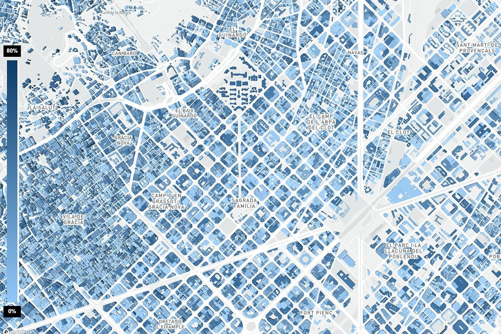

# CITY LIBRARY
[Deployed Version](https://iaac.github.io/citi-library-app/)

#### Enhanced Databses on City's Building Material Stock using GANs.

An urban mining method based on machine learning for enabling building’s materials reuse strategies.


## Documentation


The aim of this project is to develop a web platform for City's Building Material Stock using AI. The project was created for the Urban Mining research design studio @ IAAC where the students can use the platform to extract building materials information and integrate that with other 3D and GIS modeling environments.

#### Front End
The collaborative platform's front end has been developed using a client-server web application architecture to facilitate communication between the compiled material dataset and the web platform front-end interface which visualize data on the browser and receive search parameters from users. This workflow was developed using Mapbox, Openstreetmaps, Javascript, Python.

The geometrical representation of analytical data can vary and be shaped in multiple formats such as vector layers, images, 3D interactive model, charts, and statistical data for the material percentages as a result from the GAN model. These different layers and data are being stored on the server and could be requested using Mapbox and Javascript.

The user interaction takes place on the platform interface that consists of two main parts corresponding to the associated activities: A main wide layout that shows the map plus the Geojson file, and a side bar that shows statistical data plus raster images. This simple interface affords a higher level of communication between the user and the prototype.

Built using HTML, and styled with CSS, the frontend will host the interactive Mapbox interface and the static builing materials layers as well.


Workflow Diagram


The mapbox frontend interactive interface


Partial static layer display

#### Back End
The standalone backend will allow extracting imagery data using GoogleStreetViews API and feed that to a trained GAN model that can identify, geolocate and quantify façade materials with a present accuracy of 87%. The developed method proposes an alternative automated way to physical inspections which makes it applicable to different cities that lack registers of building data. 

The trained model is used to make a prediction for one image of each building facade and reference it back to open urban data through the building ID. Such data, available for the city of Barcelona includes year of construction, building use, building area, historical protection status, building occupancy, etc. Additional columns containing facade level predictions (facade percentage and facade area of: plaster, brick, stone, metal, timber and glass) were added to the database, which was then exported in CSV and .shp format. 

Having the compiled database in a CSV file format, allowed the flexibility of exchanging the data with different platforms. During our research both offline and online user-friendly tools such as Rhinoceros3D and QGIS were needed to allow users to interact with the materials dataset locally. The two frameworks attached below have been proposed as preliminary prototypes which involves the development virtual environment for the analysis and evaluation of the building’s material recognition model. Both frameworks have the flexibility to be used in all levels of urban analysis and materials extraction.

The backend was built using Python and other libraries such as rtree, geopandas, folium, osmnx, gegmis, sklearn, and numpy.


Image standardization technique showing the centroid projection to street, in blue, and the adjusted camera position and angle, in red.


Final model generate fake images sample


The interface of the local model using Rhinoceros and Grasshopper3d script.
## Getting Started

Clone the project

```bash
  git clone https://github.com/IaaC/citi-library-app
```


To be able to query live data based on a point geolocation + radius, open the backend file using Jupyter notebooks or Google Colab

```bash
  BackEnd_PointMethod.ipynb
```


Define the MAP LOCATION parameters 

```bash
lat = ....
lng = ....
radius = ....
```


Define the GOOGLE STREET VIEWS API parameters

```bash
imgroot = downloaded images path
c_imgroot = cropped images path
d_imgroot = duplicate images path
l_imgroot = labeled images path
api_key = 'GSV API'
```

Define the GAN model parameters

```bash
!python test.py 
--dataroot c_imgroot 
--direction AtoB 
--model pix2pix 
--checkpoints_dir /trained model path/ 
--name CITY_LIBRARY_pix2pix_3 
--results_dir /labeled images path  
```

Download the materials CSV file

```bash
dfd.to_csv('/content/drive/MyDrive/CITY_LIBRARY/01_GSV/Mats.csv') 
```

To be able to upload Geojson files , open the backend file using Jupyter notebooks or Google Colab

```bash
  BackEnd_FileMethod.ipynb
```


Start the server to interact with the frontend

```bash
  npm run start
```

